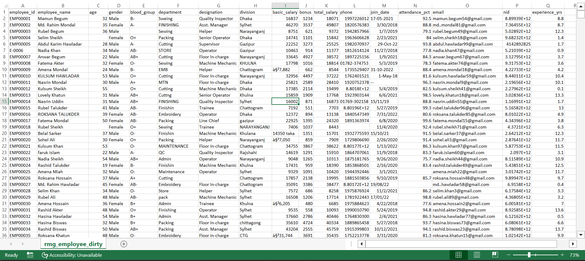
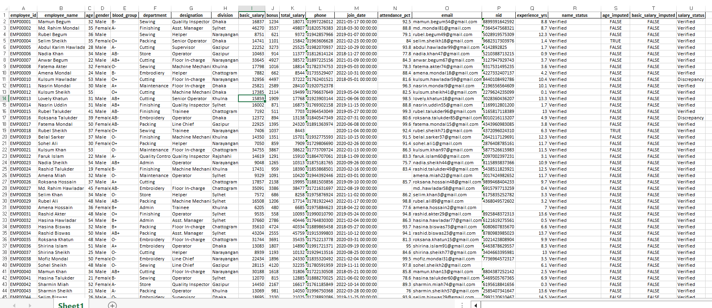
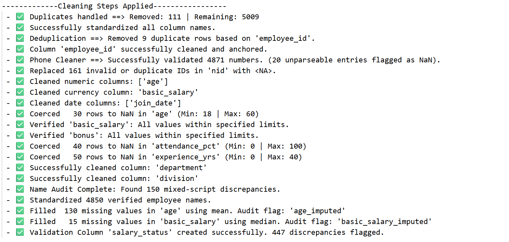
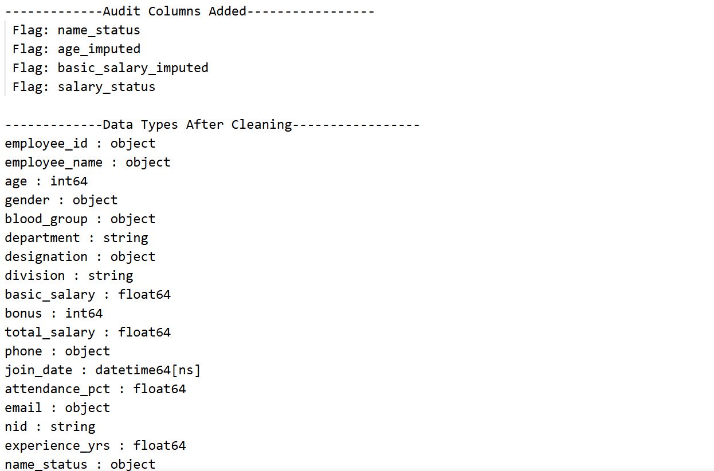

# 🏭 Automated HR Data Cleaning Pipeline

A configuration-driven Python pipeline that transforms messy HR datasets into clean, analytics-ready Excel files. The project automates common data quality issues found in Bangladesh's Ready-Made Garment (RMG) sector, including duplicate records, inconsistent categories, invalid identifiers, missing values, and payroll validation.

## ✨ Features

- Clean and standardize employee IDs
- Validate Bangladeshi phone numbers and NIDs
- Standardize categorical values (Department, Division, etc.)
- Parse mixed-format dates
- Clean currency and numeric columns
- Detect mixed Bengali-English names
- Perform group-wise missing value imputation
- Validate payroll calculations (`Basic + Bonus = Total`)
- Generate automated data quality reports

---

## 🛠 Tech Stack

- Python
- pandas
- NumPy
- Regular Expressions (Regex)
- Object-Oriented Programming (OOP)

---

## 📸 Before & After

### Raw Dataset



### Cleaned Dataset



### Sample Quality Report




---

## 📁 Project Structure

```text
messy-data-pipeline/
│
├── data/                  # Raw CSV files
├── clean/                 # Cleaned Excel files
├── reports/               # Data quality reports
├── 01.sandbox_diagnostics.ipynb
├── data_cleaner.py
├── run.py
└── README.md

```

---

## ▶️ Run

```bash
pip install pandas numpy openpyxl

python run.py
```

Place your raw CSV files inside the `data/` folder.

The pipeline automatically generates:

- Cleaned Excel files in `clean/`
- Audit reports in `reports/`

---

## 🎯 Skills Demonstrated

- Data Cleaning
- ETL Pipeline Development
- Data Validation
- Data Quality Auditing
- pandas Automation
- Object-Oriented Programming
